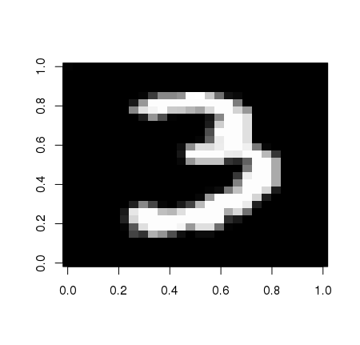

# Exploration in classification using MNIST data

The aim of this project is to predict handwritten digits from the famous MNIST dataset. For this 
project, the data representing one image comes in the form of 784 values, 
making a 28 by 28 pixel image. Each of the values can range between 0 and 255. 

My first step was building a function to visualize the provided data. Here is a random row from the dataset:



This project was inspired by the Digit Regognizer [Kaggle Competition](https://www.kaggle.com/c/digit-recognizer/data).

## LDA

Linear Discriminant Analysis projects the vectors into a subspace that maximizes the between class variance. This projection can then be used as a naive classifier. Let us examine the effectiveness of this approach.

LDA cannot be used when within-class covariance matrices  are singular, so the first step is to remove all low variability factors. The following code sample uses the number of unique values in each column (factor) to remove low variability columns from a data frame, `df`, in an efficient manner.  

```R
df = df[,apply(df, 2, function(col) {
  length(unique(col)) > n 
})]
```

In the context of our problem, these factors would be pixels are similar in every image, such as the corners. I used the number of unique values in each column (factor) to remove low variability columns. This reduced the number of factors by about 100 - 120. 

In order to evaluate the accuracy of the classification, I am randomly dividing the labeled data set (42,000 images) into a training and testing data set a 9:1 ratio.

### Result

Classification using LDA correctly identified the images **about 86% of the time**. It was efficient enough that multiple trials could be run in the span of a few minutes on a personal machine. 

## k-NN

The k-Nearest Neighbors algorithm uses the euclidean distance between vectors to determine the classification of training vectors.

As with LDA, the data set is randomly divided into training and testing data sets, at a ratio of 9:1. 

### Result

Classification using k-NN had an accuracy of **about 96%**. Because this method is more computationally complex than LDA, a single trial could take more than 15 minutes.


## k-NN with PCA

The approach using k-Nearest Neighbors is an effective classifier, but is too slow for everyday use. Principal component analysis can be used for dimensionality reduction by orthogonally transforming the data. The goal of PCA is to reduce the number of dimensions, while retaining as much variance as possible in the data set. 

The following sample demonstrates how to use PCA in conjunction with k-NN. First, we apply PCA to the training data set. We then project the original train and test data onto the first 150 principal components. This new data is then passed to the knn function.  

```R
dPca = prcomp(trainSet)

# columns are eigenvectors, use first 150 principal components
trainPca = as.matrix(trainSet) %*% dPca$rotation[ , 1:150]  
testPca = as.matrix(testSet[ , -1]) %*% dPca$rotation[ , 1:150]
fitPca = knn(trainPca, testPca, trainLabels)
```

### Result 

When applying PCA to the MNIST data, the first 150 principal components accounted for about 95% of the variance in the data. We can then use k-NN on the reduced dataset, with 150 variables per image rather than 785. This is much more computationally efficient and in my testing was actually slightly more accurate, with **97% of the images correctly identified**.

